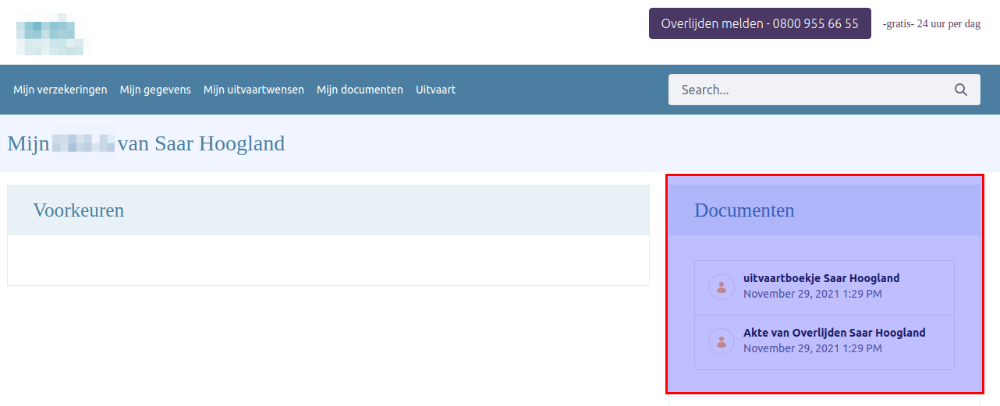

# SharedFiles Collection Provider

For an insurance demo I needed to show documents that are shared with a customer (1-to-1).
Of course we have the share-widget in the userprofile but I needed a different view.

This new Collection Provider will select all files that are shared for that particular user.
Now you can simply use assetpublisher or collection fragments to display the shared files.

Developed to run on the following versions of Liferay DXP: `Liferay DXP 7.4`

Built with [Liferay Workspace](https://help.liferay.com/hc/en-us/articles/360029147471-Liferay-Workspace) and [Blade CLI](https://help.liferay.com/hc/en-us/articles/360029147071-Blade-CLI).

*Showing shared documents in a page with the SharedFiles Collection Provider*



## How to Build and Deploy to Liferay

Follow the steps below to build and deploy or copy the modules from the [releases](../../releases/latest) page to your Liferay's deploy folder.

In order to build or deploy this module you will need to [install Blade CLI](https://help.liferay.com/hc/en-us/articles/360028833852-Installing-Blade-CLI).

### To Build

`$ blade gw build`

You can find the built modules at `modules/{module-name}/build/libs/{module-name}.jar`.

### To Deploy

In `gradle-local.properties` add the following line to point towards the Liferay instance you want to deploy to:
```
liferay.workspace.home.dir=/path/to/liferay/home
```

`$ blade gw deploy`

## Usage
1. Add an Asset Publisher to your page and select the SharedFiles Collection Provider.
2. Share 1 or more documents with a particular user.
3. Impersonate as this user and go to the page where you added the Asset Publisher.

### Features

* Show shared files on a page

## Issues & Questions Welcome